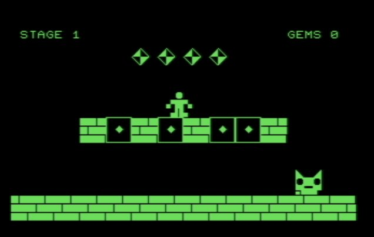

# PetMan

Build using ACME assembler

for PET version: acme.exe pm.asm
c64 version: acme.exe pm64.asm

control on PET are:
Space to jump
0 to go left
. to go right

on C64:
Space to jump
, to go left
. to go right

I tryed to make the game aware of the keyboard layout on the PET but there could still have some issue or miss placement.
